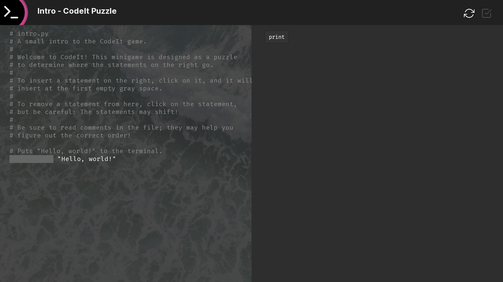

# CodeIt

A "fill in the blank" Python coding game



This is a small project that implements a small mini game where players have to click on the Python statements on the right to fill in the Python script on the left. Most of the code relies on some parts to Unscripted, but can be slightly modified as necessary.

## Requirements

- Ren'Py 7 or higher
- Feather Icons
- AliceOS 2.0.0 (Prospect Park) or higher

## Installation

1. Drag the `minigame` folder into the `game` folder of your Ren'Py project.
2. Create a folder for Feather icons in your Ren'Py project and copy all of them there.

## Modifications

You might need to code in the `get_feather_icon` method for some parts to work:

```renpy
init -10 python:
    def get_feather_icon(s):
        return "path/to/feather/icons/" + s + ".png"
```

Please also check the source code to make sure the paths point to whatever assets or directories this game will take place in.

## Writing custom puzzles

Write a Python script in the `puzzles` directory and replace some statements with `%v`. Then, in `logic.rpy`, update the `puzzles` dictionary in the `CodeIt()` class with the path to the file and the correct order of statements. For example, for a puzzle called `oof.py`:

```python
%v = "foo"

%v die(s):
    %v s[::1]

%v(oof)
```

Then in `logic.rpy`:

```python
puzzles = {
    "intro": ("puzzles/intro.py", ["print"]),
    "compile": ("puzzles/compile.py", []),
    "oof": ("puzzles/oof.py", ["oof", "def", "return", "die"]),
}
```

## License
This Source Code Form is subject to the terms of the Mozilla Public License, v. 2.0. If a copy of the MPL was not distributed with this file, You can obtain one at https://mozilla.org/MPL/2.0/.